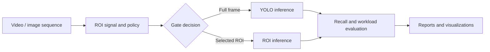
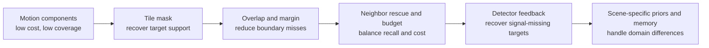
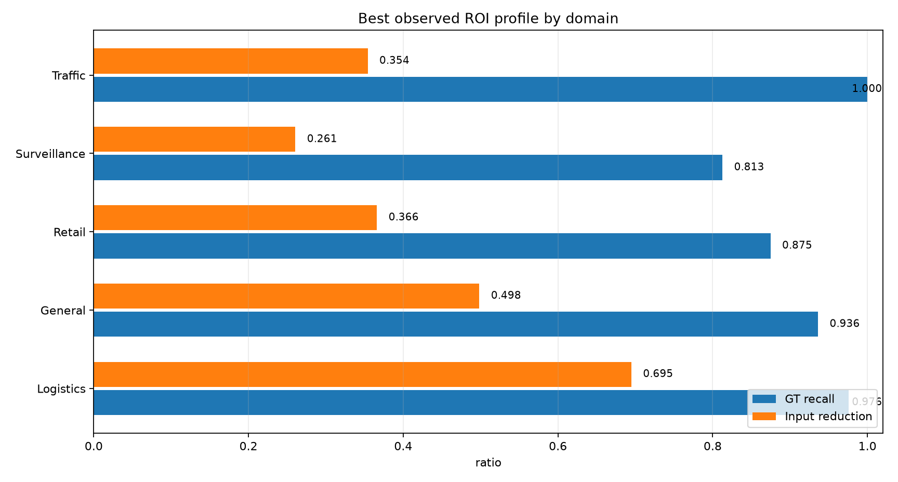

# Vision Frontend Simulator

Vision Frontend Simulator는 카메라 영상에서 관심 영역(ROI)을 먼저 선택해 GPU detector로 전달했을 때, 객체 탐지 품질을 유지하면서 inference workload를 줄일 수 있는지 검증하는 Python 연구 프로젝트입니다.

실제 하드웨어나 production runtime을 구현하는 저장소는 아닙니다. 고정 카메라 및 공개 영상 dataset을 사용해 ROI Gate 후보를 비교하고, 다음 구현 단계에서 검토할 architecture를 좁히는 용도로 만들어졌습니다.



## 현재 상태

- video/image sequence loader, rule-based ROI generator, YOLO inference, evaluation, visualization까지 전체 검증 pipeline이 구현되어 있습니다.
- motion/component, tile mask, small-object overlap, neighbor rescue, budget/fallback, detector feedback을 순차적으로 비교했습니다.
- 이후 static/road prior, tracker memory, temporal guard, lightweight visual signal까지 넓혀 5개 domain에서 검증했습니다.
- 최종적으로 scene 특성에 맞춘 architecture family 3개를 다음 구현 후보로 남겼습니다.
- 후보들은 prototype과 oracle 실험을 포함한 연구 결과이며, production runtime으로 통합된 상태는 아닙니다.

현재 결론과 남은 작업은 [docs/current_status.md](docs/current_status.md), 코드 구조는 [docs/architecture.md](docs/architecture.md)에서 확인합니다.

## 전체 연구 결과

연구는 먼저 고정 카메라 한 scene에서 motion/tile policy의 recall-cost trade-off를 개선한 뒤, 다른 scene에도 같은 접근이 일반화되는지 확인하는 방향으로 진행했습니다.

### Motion/tile policy의 발전 과정

| 접근 | 검증 범위 | Target containment | 유효 입력 절감 | 결론 |
|---|---|---:|---:|---|
| Motion/component baseline | PhysicalAI 초기 120 frames | 0.042 | 0.985 | 매우 저렴하지만 작거나 느리거나 정지한 사람을 대부분 놓침 |
| Tile mask baseline | PhysicalAI 600 frames | 0.544 | 0.855 | component보다 coverage가 개선되지만 boundary miss가 많음 |
| Tile + small-object overlap | PhysicalAI 600 frames | 0.641 | 0.838 | 별도 detector feedback 없이 사용할 수 있는 practical baseline |
| Neighbor rescue + budget cap | PhysicalAI 600 frames | 0.699 | 0.821 | 인접 tile miss를 줄이면서 ROI 수와 fallback을 제한한 기본 후보 |
| YOLO feedback + confidence decay | PhysicalAI 600 frames | 0.753 | 0.808 | 가장 높은 containment를 보였지만 detector 의존성과 tensor cost가 증가 |



첫 motion baseline은 초기 120-frame 진단이고 이후 네 결과는 동일한 600-frame 구간에서 비교한 값이므로, 첫 행과 나머지 행을 직접적인 순위 비교로 해석하면 안 됩니다. 600-frame 비교에서는 tile coverage를 넓히거나 detector feedback을 더할수록 containment가 `0.544 → 0.753`으로 개선됐지만 입력 절감은 `0.855 → 0.808`로 감소했습니다.

### 여러 domain으로 확장한 결과

Motion/tile 계열이 다른 scene에서도 그대로 동작하는지 확인한 결과, warehouse 이외의 scene에서는 global motion, 작은 객체, 신규 진입 객체 때문에 하나의 primary gate로 일반화하기 어려웠습니다. 이에 scene별 spatial prior와 temporal memory를 결합한 후보를 비교했습니다.

아래 값은 각 domain에서 관찰된 대표 profile의 결과입니다. detector의 실제 latency 향상이 아니라 **GT recall과 detector에 전달되는 유효 입력 또는 선택 면적의 절감 정도**를 나타냅니다.

| Domain | 검증 데이터 | 추천 방향 | GT recall | 입력/면적 절감 | 판단 |
|---|---:|---|---:|---:|---|
| Logistics / smart factory | PhysicalAI 600 frames | static zone + tracker memory + refresh guard | 0.976 | 0.695 | 다음 구현 우선 후보 |
| General multi-class | VisDrone 464 frames | static zone + tracker memory + refresh guard | 0.936 | 0.498 | 다음 구현 후보 |
| Retail / space analytics | Mall 600 frames | static zone + lightweight visual priority | 0.875 | 0.366 | packing 개선 필요 |
| Surveillance / security | MOT17 600 frames | static zone + lightweight visual priority | 0.813 | 0.261 | packing 개선 필요 |
| Traffic / parking | UA-DETRAC 600 frames | segmented road/lane prior + entry guard | 1.000 | 0.354 | oracle upper bound, 구현 전 단계 |



### 전체적으로 확인한 것

- Motion/component는 입력을 크게 줄일 수 있지만 slow/static target을 놓치기 쉬웠습니다.
- Tile, overlap, margin, neighbor rescue는 boundary coverage를 단계적으로 개선했지만 선택 면적과 tensor cost가 함께 증가했습니다.
- Detector feedback은 signal-missing target을 복구하는 데 효과가 있었지만, detector 호출 자체가 새로운 비용과 의존성이 됐습니다.
- 하나의 ROI Gate가 모든 scene에 잘 맞지는 않았습니다. Logistics/General은 tracker memory, Retail/Surveillance는 lightweight visual priority, Traffic은 road/lane prior가 더 적합했습니다.
- 모든 최종 후보에서 ROI merge/packing, budget controller, non-oracle detector refresh 검증이 다음 공통 과제입니다.

세부 근거는 [초기 validation 기록](docs/runs/phase1/phase1_validation_runs.md), [tile/feedback policy 선택](docs/runs/phase1_1/phase1_1_final_closure_20260825.md), [neighbor rescue 결과](docs/runs/phase1_2/phase1_2_workstream_c_neighbor_rescue_20260901.md), [feedback retuning 결과](docs/runs/phase1_2/phase1_2_workstream_d_feedback_retuning_20260901.md), [600-frame hybrid 검증](docs/runs/phase1_3/phase1_3_hybrid_family_600frame_validation_20260917.md), [최종 domain recommendation](docs/runs/phase1_3/phase1_3_final_domain_recommendation_matrix_20260917.md)에 정리되어 있습니다. README용 그림의 생성 경로는 [docs/assets/results/README.md](docs/assets/results/README.md)에서 확인할 수 있습니다.

## 실행 흐름

```text
Dataset stream
  -> ROI signal / policy
  -> GateDecision and ROI metadata
  -> full-frame or ROI YOLO inference
  -> evaluation report
  -> visualization
```

주요 실행 경로는 다음 세 가지입니다.

1. ROI generator만 실행해 ROI metadata를 생성합니다.
2. ROI proposal을 ground truth와 비교해 containment와 workload를 평가합니다.
3. Full-frame YOLO와 ROI YOLO를 함께 실행해 end-to-end 결과를 비교합니다.

## Quick Start

Python 3.11 이상과 가상환경 사용을 권장합니다. 모든 명령은 저장소 root에서 실행합니다.

```bash
python -m venv .venv
source .venv/bin/activate
python -m pip install -r requirements.txt
python -m unittest discover -s tests
```

외부 dataset 없이 synthetic smoke test를 실행할 수 있습니다.

```bash
python tools/data/create_smoke_video.py

python experiments/run_rule_roi_baseline.py \
  --dataset-config configs/datasets/base/smoke.yaml \
  --roi-generator-config configs/roi_generator/base/smoke.yaml \
  --limit 60
```

결과는 아래 파일에 저장됩니다.

```text
outputs/roi_metadata/rule_roi.jsonl
outputs/roi_metadata/gate_decisions.jsonl
```

공개 sample과 E2E inference를 포함한 다음 단계는 [Quick Start Guide](docs/how-to/quickstart.md)를 따릅니다.

## 처음 읽을 문서

| 순서 | 문서 | 내용 |
|---:|---|---|
| 1 | [docs/current_status.md](docs/current_status.md) | 완료 범위, 핵심 결론, 한계, 다음 작업 |
| 2 | [docs/architecture.md](docs/architecture.md) | 모듈 구조와 데이터 흐름 |
| 3 | [docs/how-to/quickstart.md](docs/how-to/quickstart.md) | 설치, 테스트, smoke, sample 실행 |
| 4 | [docs/runs/README.md](docs/runs/README.md) | 접근별 실험 기록과 상세 결과 탐색 |
| 5 | [docs/README.md](docs/README.md) | 전체 문서 탐색 방법 |

## 디렉터리 구조

| 경로 | 역할 |
|---|---|
| `common/` | pipeline이 공유하는 frame, ROI, detection schema와 I/O helper |
| `data_loader/` | video/image sequence와 dataset annotation loader |
| `roi_generator/` | signal 생성, ROI policy, budget/fallback, metadata 기록 |
| `gpu_inference/` | full-frame/ROI YOLO 실행과 좌표 복원 |
| `evaluation/` | detection, containment, workload, latency metric과 report |
| `visualization/` | ROI/detection 비교 및 실패 사례 렌더링 |
| [`experiments/`](experiments/README.md) | 대표 validation runner와 연구 단계별 재현 script |
| `configs/` | dataset, ROI generator, model, experiment YAML |
| `tools/` | dataset 준비, synthetic data, report/review 보조 도구 |
| `tests/` | 모듈별 unit test |
| `docs/` | 현재 상태, 실행법, 과거 계획과 실험 결과 |
| `data/` | 로컬 dataset. Git에서 제외 |
| `outputs/` | 로컬 실험 결과. Git에서 제외 |

## 작업 시 주의사항

- `common/schemas.py`와 `roi_generator/core/contract.py`는 여러 단계가 공유하는 데이터 계약입니다.
- `configs/**/*.yaml` 변경은 결과 해석에 영향을 주므로 관련 run 문서에 변경 이유를 남깁니다.
- dataset, model weight, 생성된 output은 저장소에 commit하지 않습니다.
- `docs/plan/`은 작성 당시의 계획, `docs/runs/`는 실제 실행 결과입니다. 현재 판단은 `docs/current_status.md`를 우선합니다.
- 하드웨어, RTSP, DeepStream, TensorRT 연동은 아직 이 저장소의 구현 범위가 아닙니다.
